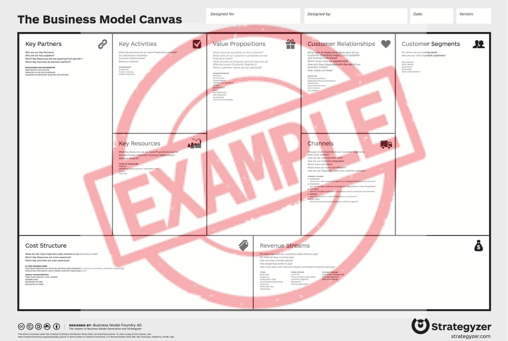

# Especificação do projeto

Pré-requisitos: <a href="01-Contexto.md"> Documentação de contexto</a>

Esta seção apresenta a definição do problema e a proposta de solução sob a perspectiva do usuário, utilizando técnicas de modelagem que permitam compreender e detalhar as necessidades do negócio e as funcionalidades esperadas do sistema.  

Nesta seção são apresentadas as personas, histórias de usuários, requisitos funcionais e não funcionais, bem como as restrições do projeto. Também são descritas as ferramentas e metodologias empregadas para elaborar essas especificações, garantindo que todos os participantes possuam uma compreensão unificada do escopo, dos objetivos e das prioridades do trabalho.

## Modelo de negócio (*Business Model Canvas*)

O *Business Model Canvas* (BMC) é uma ferramenta de planejamento estratégico que descreve, de forma visual e integrada, como uma organização cria, entrega e captura valor.  

No contexto deste projeto, o BMC auxilia no alinhamento da equipe em relação aos aspectos essenciais do negócio, servindo como base para decisões técnicas, de design e de priorização de funcionalidades.  

A seguir, apresenta-se um exemplo que deve ser adaptado pelo grupo de acordo com as características do projeto.  

> **Links úteis**:
> - [Quadro de modelo de negócios](https://pt.wikipedia.org/wiki/Quadro_de_modelo_de_neg%C3%B3cios)
> - [Business Model Canvas: como construir seu modelo de negócio?](https://digital.sebraers.com.br/blog/estrategia/business-model-canvas-como-construir-seu-modelo-de-negocio/)

## Personas

1. **Ana (Pequena Empresária):** 32 anos, dona de uma padaria. Precisa reduzir custos fixos. Quer monitorar o consumo de gás e energia dos fornos e saber se seus funcionários estão desperdiçando recursos.
2. **Carlos (Gestor ESG):** 45 anos. Precisa de dados precisos baseados em tabelas oficiais para relatórios de sustentabilidade da empresa.
3. **Vander (O Pai e Empreendedor):** 65 anos. Controla as contas de casa e do seu bar. Precisa de facilidade para gerenciar ambos os contextos. O sistema deve permitir que ele cadastre sua residência e o bar (múltiplos CNPJs/CPFs) e alterne entre eles conforme necessário, mantendo a simplicidade e o alerta de variações.

> **Links úteis**:
> - [Rock content](https://rockcontent.com/blog/personas/)
> - [Hotmart](https://blog.hotmart.com/pt-br/como-criar-persona-negocio/)
> - [O que é persona?](https://resultadosdigitais.com.br/blog/persona-o-que-e/)
> - [Persona x público-alvo](https://flammo.com.br/blog/persona-e-publico-alvo-qual-a-diferenca/)
> - [Mapa de empatia](https://resultadosdigitais.com.br/blog/mapa-da-empatia/)
> - [Mapa de stalkeholders](https://www.racecomunicacao.com.br/blog/como-fazer-o-mapeamento-de-stakeholders/)

## Participantes do Processo de Negócio

| PERFIL DE USO | RESPONSABILIDADE PRINCIPAL |
| :--- | :--- |
| **Proprietário (User)** | Ator central do sistema. Realiza o cadastro (CPF), gerencia múltiplas unidades (CNPJ/Residência) e lança todos os dados. |
| **Operador Administrativo** | *Perfil Conceitual*: No MVP, este papel é desempenhado pelo próprio Proprietário ao realizar lançamentos de rotina. |
| **Auditor** | *Perfil Conceitual*: No MVP, este papel é desempenhado pelo Proprietário ao extrair relatórios para fins de conformidade. |

## Histórias de usuários

Com base na análise das personas, foram identificadas as seguintes histórias de usuários:

|EU COMO... `PERSONA`| QUERO/PRECISO ... `FUNCIONALIDADE` |PARA ... `MOTIVO/VALOR`                 |
|--------------------|------------------------------------|----------------------------------------|
|Ana (Empresária)    | Lançar o consumo de combustível das entregas | Calcular a pegada de carbono da logística da minha padaria. |
|Carlos (Gestor)     | Configurar a sensibilidade do alerta de variação | Ajustar o monitoramento para a realidade sazonal da minha empresa (respeitando o mínimo de 15%). |
|Usuário Geral       | Ver dicas de como reduzir meu consumo | Aprender a ser mais sustentável e economizar dinheiro. |
|Vander (Pai)        | Ser alertado se houver uma variação grande (acima de 15%) no consumo | Verificar se há vazamentos ou problemas na rede elétrica imediatamente. |
|Vander (Pai)        | Ver quantas árvores eu precisaria plantar para compensar meu consumo | Ter uma noção real do meu impacto ambiental e como posso ajudar o planeta. |
|Vander (Pai)        | Alternar entre o perfil de casa e do bar | Gerenciar as contas de ambos os locais em um único lugar. |

Apresente aqui as histórias de usuários que são relevantes para o projeto da sua solução. As histórias de usuários consistem em uma ferramenta poderosa para a compreensão e elicitação dos requisitos funcionais e não funcionais da sua aplicação. Se possível, agrupe as histórias de usuários por contexto, para facilitar consultas recorrentes a esta parte do documento.

> **Links úteis**:
> - [Histórias de usuários com exemplos e template](https://www.atlassian.com/br/agile/project-management/user-stories)
> - [Como escrever boas histórias de usuário (user stories)](https://medium.com/vertice/como-escrever-boas-users-stories-hist%C3%B3rias-de-usu%C3%A1rios-b29c75043fac)
> - [User stories: requisitos que humanos entendem](https://www.luiztools.com.br/post/user-stories-descricao-de-requisitos-que-humanos-entendem/)
> - [Histórias de usuários: mais exemplos](https://www.reqview.com/doc/user-stories-example.html)
> - [9 common user story mistakes](https://airfocus.com/blog/user-story-mistakes/)

## Requisitos

As tabelas a seguir apresentam os requisitos funcionais e não funcionais que detalham o escopo do projeto. Para determinar a prioridade dos requisitos, aplique uma técnica de priorização e detalhe como essa técnica foi aplicada.

### Requisitos funcionais

|ID    | Descrição do Requisito  | Prioridade |
|------|-----------------------------------------|----|
|RF-001| O sistema deve permitir o lançamento de diversos tipos de consumo (Água, Luz, Combustível, Resíduos) baseados em tabelas oficiais. | ALTA | 
|RF-002| O sistema deve calcular a pegada de carbono e exibir a equivalência em árvores necessárias para compensação. | ALTA |
|RF-003| O sistema deve validar variações mensais e emitir alertas se o consumo variar acima de um percentual configurável pelo usuário (respeitando o mínimo de 15%). | ALTA |
|RF-004| O sistema deve apresentar dicas de conscientização e redução de desperdício baseadas no tipo de consumo lançado. | MÉDIA |
|RF-005| O sistema deve permitir o controle de acesso e autenticação de usuários. | ALTA |
|RF-006| O sistema deve garantir o isolamento de dados entre diferentes empresas (Multi-tenancy). | ALTA |
|RF-007| O sistema deve permitir que um único usuário (CPF) gerencie múltiplos CNPJs (Matriz/Filiais ou Negócios distintos). | ALTA |
|RF-008| O sistema deve bloquear o cadastro de CNPJ ou E-mail Corporativo já existentes para evitar fraudes e duplicidade. | ALTA |

### Requisitos não funcionais

|ID     | Descrição do Requisito  |Prioridade |
|-------|-------------------------|----|
|RNF-001| O sistema deve ser uma aplicação web responsiva (acessível via navegador), sendo a versão mobile apenas conceitual. | ALTA | 
|RNF-002| O sistema deve garantir a segurança dos dados (LGPD) com criptografia. | ALTA |

### Parâmetros de Sustentabilidade (Fatores de Emissão)

O backend utiliza fatores de conversão alinhados com o Inventário Nacional de Emissões (MCTI) e GHG Protocol para atender ao RF-002:

*   **Energia Elétrica (SIN):** Média móvel do grid nacional (~0,042 kgCO2e/kWh).
*   **Água Potável:** Fator de tratamento e distribuição (~0,35 kgCO2e/m³).
*   **Gasolina Comum:** Combustão móvel (~2,27 kgCO2e/Litro).
*   **GLP (Gás de Cozinha):** Combustão estacionária (~2,98 kgCO2e/kg).

Com base nas histórias de usuários, enumere os requisitos da sua solução. Classifique esses requisitos em dois grupos:

- [Requisitos funcionais
 (RF)](https://pt.wikipedia.org/wiki/Requisito_funcional):
 correspondem a uma funcionalidade que deve estar presente na
  plataforma (ex: cadastro de usuário).
- [Requisitos não funcionais
  (RNF)](https://pt.wikipedia.org/wiki/Requisito_n%C3%A3o_funcional):
  correspondem a uma característica técnica, seja de usabilidade,
  desempenho, confiabilidade, segurança ou outro (ex: suporte a
  dispositivos iOS e Android).

Lembre-se de que cada requisito deve corresponder a uma e somente uma característica-alvo da sua solução. Além disso, certifique-se de que todos os aspectos capturados nas histórias de usuários foram cobertos.

> **Links úteis**:
> - [O que são requisitos funcionais e requisitos não funcionais?](https://codificar.com.br/requisitos-funcionais-nao-funcionais/)
> - [Entenda o que são requisitos de software, a diferença entre requisito funcional e não funcional, e como identificar e documentar cada um deles](https://analisederequisitos.com.br/requisitos-funcionais-e-requisitos-nao-funcionais-o-que-sao/)

## Restrições

Enumere as restrições à sua solução. Lembre-se de que as restrições geralmente limitam a solução candidata.

O projeto está restrito aos itens apresentados na tabela a seguir.

|ID| Restrição                                             |
|--|-------------------------------------------------------|
|001| O sistema será desenvolvido exclusivamente como aplicação web. O suporte a dispositivos móveis será via navegador (responsividade), sem desenvolvimento de aplicativo nativo. |
|002| O sistema deve respeitar as diretrizes da LGPD, garantindo a privacidade dos dados dos usuários. |
|003| O backend deve ser desenvolvido em Node.js e o banco de dados deve ser MongoDB (NoSQL). |
|004| É obrigatório o cadastro de um e-mail pessoal (para o CPF) e um e-mail corporativo (para o CNPJ) distintos ou iguais, para fins de auditoria e recuperação. |

## Diagrama de casos de uso

O diagrama de casos de uso é o próximo passo após a elicitação de requisitos. Ele utiliza um modelo gráfico e uma tabela com as descrições sucintas dos casos de uso e dos atores. O diagrama contempla a fronteira do sistema e o detalhamento dos requisitos funcionais, com a indicação dos atores, casos de uso e seus relacionamentos.

As referências abaixo irão auxiliá-lo na geração do artefato “diagrama de casos de uso”.

> **Links úteis**:
> - [Criando casos de uso](https://www.ibm.com/docs/pt-br/engineering-lifecycle-management-suite/design-rhapsody/10.0?topic=cases-creating-use)
> - [Como criar diagrama de caso de uso: tutorial passo a passo](https://gitmind.com/pt/fazer-diagrama-de-caso-uso.html/)
> - [Lucidchart](https://www.lucidchart.com/)
> - [Astah](https://astah.net/)
> - [Diagrams](https://app.diagrams.net/)
