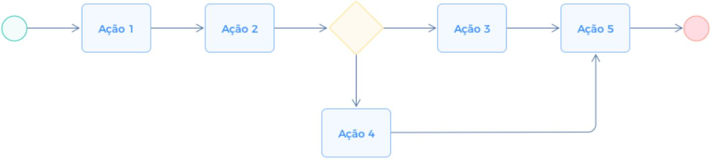

# Projeto de interface

Pré-requisitos: <a href="02-Especificacao.md"> Especificação do projeto</a>

Visão geral da interação do usuário pelas telas do sistema e protótipo interativo das telas com as funcionalidades que fazem parte do sistema (wireframes).

 Apresente as principais interfaces da plataforma. Discuta como ela foi elaborada de forma a atender os requisitos funcionais, não funcionais e histórias de usuário abordados na <a href="02-Especificacao.md"> Especificação do projeto</a>.

 ## User flow

Fluxo de usuário (user flow) é uma técnica que permite ao desenvolvedor mapear todo o fluxo de navegação do usuário na aplicação. Essa técnica serve para alinhar os caminhos e as possíveis ações que o usuário pode realizar junto com os membros da equipe.

### Fluxo Principal: Monitoramento do Vander

Este fluxo descreve a jornada do usuário Vander ao verificar alertas e alternar entre seus negócios.

1.  **Acesso:** Vander abre o site CO2ntaZero.
2.  **Login:** Insere e-mail e senha. Se não tiver conta, clica em "Cadastrar".
3.  **Dashboard (Casa):** O sistema carrega por padrão os dados da residência.
4.  **Alerta:** O ícone de sino indica uma notificação. Vander clica e vê: *"Alerta: Consumo de energia 18% acima da média histórica."*
5.  **Troca de Contexto:** Vander clica no menu de perfil e seleciona **"Bar do Vander"**.
6.  **Dashboard (Bar):** A interface recarrega exibindo os dados e metas do bar.

> **Links úteis**:
> - [User flow: o quê é e como fazer?](https://medium.com/7bits/fluxo-de-usu%C3%A1rio-user-flow-o-que-%C3%A9-como-fazer-79d965872534)
> - [User flow vs site maps](http://designr.com.br/sitemap-e-user-flow-quais-as-diferencas-e-quando-usar-cada-um/)
> - [Top 25 user flow tools & templates for smooth](https://www.mockplus.com/blog/post/user-flow-tools)

### Diagrama de fluxo

O diagrama apresenta o estudo do fluxo de interação do usuário com o sistema interativo, muitas vezes sem a necessidade de desenhar o design das telas da interface. Isso permite que o design das interações seja bem planejado e tenha impacto na qualidade do design do wireframe interativo que será desenvolvido logo em seguida.

O diagrama de fluxo pode ser desenvolvido com “boxes” que possuem, internamente, a indicação dos principais elementos de interface — tais como menus e acessos — e funcionalidades, como editar, pesquisar, filtrar e configurar, além da conexão entre esses boxes a partir do processo de interação.

> **Links úteis**:
> - [Como criar um diagrama de fluxo de usuário](https://www.lucidchart.com/blog/how-to-make-a-user-flow-diagram)
> - [Fluxograma online: seis sites para fazer gráfico sem instalar nada](https://www.techtudo.com.br/listas/2019/03/fluxograma-online-seis-sites-para-fazer-grafico-sem-instalar-nada.ghtml)

## Wireframes

São protótipos usados no design de interface para sugerir a estrutura de um site web e seu relacionamento entre suas páginas. Um wireframe web é uma ilustração que mostra o layout dos elementos fundamentais na interface.

 
> **Links úteis**:
> - [Protótipos: baixa, média ou alta fidelidade?](https://medium.com/ladies-that-ux-br/prot%C3%B3tipos-baixa-m%C3%A9dia-ou-alta-fidelidade-71d897559135)
> - [Protótipos vs wireframes](https://www.nngroup.com/videos/prototypes-vs-wireframes-ux-projects/)
> - [Ferramentas de wireframes](https://rockcontent.com/blog/wireframes/)
> - [MarvelApp](https://marvelapp.com/developers/documentation/tutorials/)
> - [Figma](https://www.figma.com/)
> - [Adobe XD](https://www.adobe.com/br/products/xd.html#scroll)
> - [Axure](https://www.axure.com/edu) (Licença Educacional)
> - [InvisionApp](https://www.invisionapp.com/) (Licença Educacional)

## Protótipo interativo

O protótipo interativo do CO2ntaZero permite a navegação pelas principais funcionalidades, como login, dashboard de indicadores e formulários de cadastro de consumo.

> **Exemplo:** inserir link para o protótipo no Figma, MarvelApp, InvisionApp, etc.

## Jornada do usuário

A jornada do usuário descreve, em alto nível de detalhes, as etapas que diferentes perfis de usuários realizam para concluir uma tarefa específica na aplicação. Essa técnica ajuda a identificar pontos fortes e oportunidades de melhoria na experiência.  

O mapa da jornada do usuário deve contemplar:  
- Etapas: desde a descoberta até a finalização da tarefa.  
- Ações do usuário: o que o usuário faz em cada etapa.  
- Pontos de contato: onde a interação acontece (site, app, suporte).  
- Emoções e percepções: como o usuário se sente em cada momento.  

**Fases baseadas no modelo AIDA**:  
1. Conscientização: despertar conhecimento sobre o produto (inspiração)  
2. Interesse: aumentar o interesse e engajamento (favoritismo)  
3. Desejo: estimular a intenção de uso/compra (desejo)  
4. Ação: execução da ação esperada (implementação)  

> **Importante:** insira a figura do mapa da jornada do usuário para ilustrar visualmente o fluxo e as etapas descritas.

> **Links úteis**:
> - [Dicas sobre como mapear uma jornada do usuário](https://www.userinterviews.com/blog/best-customer-journey-map-templates-examples)
> - [Jornada do usuário versus user flow](https://www.nngroup.com/articles/user-journeys-vs-user-flows/)

## Interface do sistema

Apresente **todas as interfaces do sistema**, em sua versão final, descrevendo brevemente a função de cada tela.

Dê ênfase especial às telas relacionadas aos processos BPMN já mapeados e documentados no item <a href="04-Modelagem-processos-negocio.md"> Modelagem dos processos de negócio</a>.

### Tela principal do sistema

A tela principal (Dashboard) apresenta uma visão consolidada dos indicadores de consumo e sustentabilidade. O fluxo de navegação obedece ao seguinte Menu:

*   **Resumo Ambiental (Home):** Calculadora de Impacto Ambiental, medidor de "Árvores Restantes" e gráficos de evolução.
*   **Utilitários (Despesas):** Inserção e visualização de volumes de água e luz gastos.
*   **Rastreio de Resíduos:** Marcações de descarte de lixo para computar reduções.
*   **Centro de Metas:** Definições de sustentabilidade e alertas positivos.
*   **Avisos do Motor:** Notificações críticas de anomalias detectadas.

> Insira aqui a imagem da tela principal do sistema.

### Telas dos processos BPMN

#### Processo 1 - Cadastro, Login e Gestão

Este processo abrange as telas de **Login**, **Cadastro de Usuário/Empresa** e **Lançamento de Consumo**. A interface de login é limpa e segura. O cadastro de consumo apresenta formulários claros com campos para inserção de leitura (kWh, m³).

> Inserir imagens das telas de Login, Cadastro e Lançamento.

#### Processo 2 - Monitoramento de Metas

Telas dedicadas à configuração de metas de redução (ex: "Reduzir 10% em 2026") e visualização de alertas de anomalia.

> Inserir imagens das telas correspondentes às atividades do processo 2.

### Demais telas do sistema

Apresente e descreva brevemente as demais telas que compõem o sistema, mesmo que não estejam vinculadas diretamente a processos BPMN.

> Inserir imagens das demais telas.
