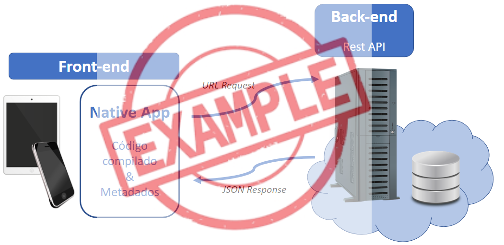
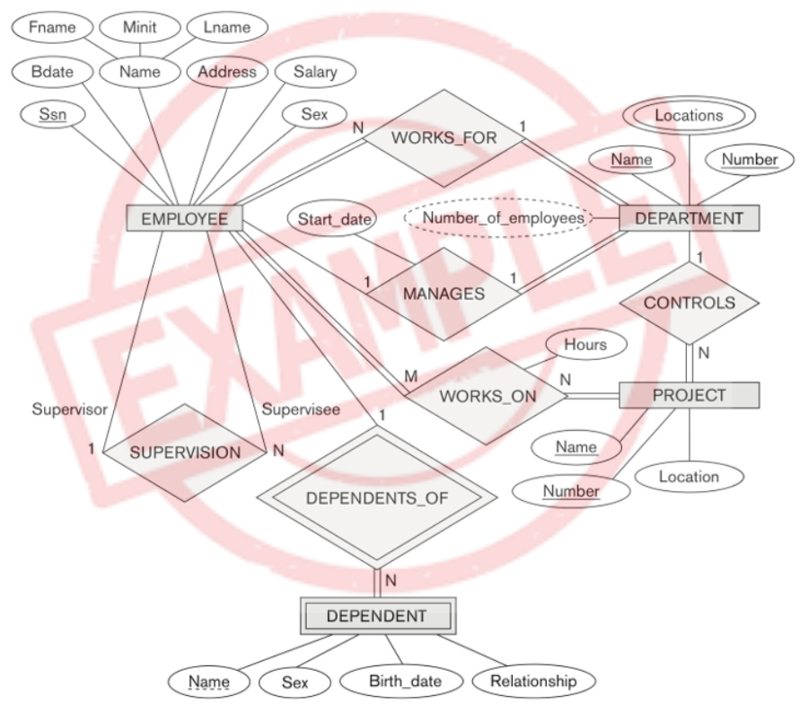
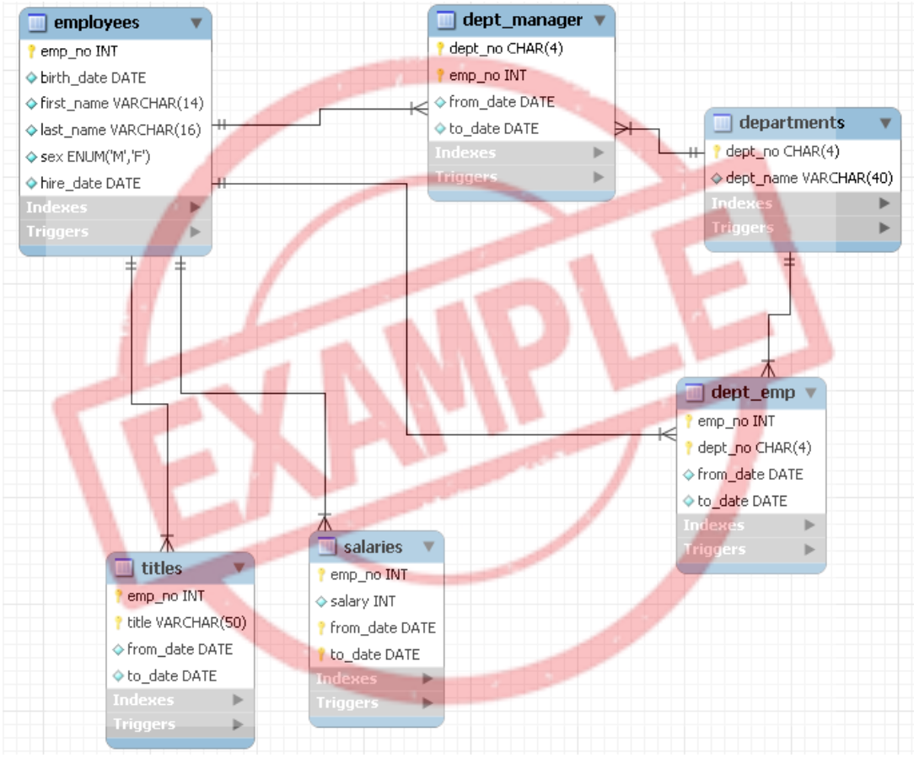

# Arquitetura da solução

<span style="color:red">Pré-requisitos: <a href="05-Projeto-interface.md"> Projeto de interface</a></span>

A arquitetura do CO2ntaZero é baseada na stack **MERN** (MongoDB, Express, React, Node.js), utilizando uma abordagem de microsserviços containerizados via Docker. A solução é orientada a eventos e projetada para **Multi-tenancy**, garantindo isolamento de dados entre diferentes empresas (Companies).

A comunicação entre o Frontend (React Web) e o Backend (Node.js API) ocorre via RESTful API, com autenticação segura via JWT (JSON Web Tokens). A persistência de dados é realizada no MongoDB Atlas (Cloud).



## Fluxo de Dados

O fluxo de informações no sistema segue uma abordagem linear e segura:

1.  **Entrada de Dados:** O usuário lança o consumo (faturas, leituras) via **Frontend Web**.
2.  **Processamento:** A **API (Backend)** recebe os dados, valida o token de sessão (JWT), e invoca o **Service Layer**.
3.  **Inteligência:** O Service calcula a emissão de CO2 com base nos fatores do MCTI e verifica anomalias (Regra de 15%).
4.  **Persistência:** O resultado processado é salvo no **MongoDB Atlas**.
5.  **Visualização:** O Gestor acessa o **Painel Admin** e visualiza os gráficos e alertas atualizados em tempo real.

## Diagrama de classes

O diagrama de classes ilustra graficamente a estrutura do software e como cada uma das classes estará interligada. Essas classes servem de modelo para materializar os objetos que serão executados na memória.

Elabore o diagrama de classes utilizando uma ferramenta de modelagem apropriada.

> **Links úteis**:
> - [Diagramas de classes - documentação da IBM](https://www.ibm.com/docs/pt-br/rational-soft-arch/9.7.0?topic=diagrams-class)
> - [O que é um diagrama de classe UML?](https://www.lucidchart.com/pages/pt/o-que-e-diagrama-de-classe-uml)

##  Modelo de dados

O desenvolvimento da solução proposta requer a existência de bases de dados que permitam realizar o cadastro de dados e os controles associados aos processos identificados, assim como suas recuperações.

### Modelo conceitual 

O modelo de dados do CO2ntaZero foi projetado para suportar a rastreabilidade de emissões e auditoria. As principais entidades são:

1. **Company:** A unidade gestora (Matriz ou Filial).
2. **User:** O proprietário da conta (CPF), que pode gerenciar múltiplas Companies.
3. **Consumption:** Registros de consumo (Energia, Água) que geram pegada de carbono.
4. **EmissionFactor:** Fatores de conversão (ex: kgCO2/kWh) baseados no GHG Protocol.
5. **Alert:** Notificações de anomalias de consumo.


---

> **Links úteis**:
> - [Notação de Peter Chen para modelagem conceitual de banco de dados](https://www.youtube.com/watch?v=_y31cFi_ByY)
> - [Como fazer um diagrama entidade-relacionamento](https://www.lucidchart.com/pages/pt/como-fazer-um-diagrama-entidade-relacionamento)

### Modelo relacional

O modelo lógico abaixo representa as coleções do banco de dados NoSQL e seus relacionamentos por referência (ObjectId).

> **Nota:** Embora o MongoDB seja NoSQL, mantemos relacionamentos lógicos para garantir a integridade referencial da aplicação.


---

> **Links úteis**:
> - [Criando um modelo relacional - documentação da IBM](https://www.ibm.com/docs/pt-br/cognos-analytics/12.0.0?topic=designer-creating-relational-model)
> - [Como fazer um modelo relacional](https://www.youtube.com/watch?v=DWWIREUkxOI)


### Modelo físico

Como utilizamos MongoDB com Mongoose, o modelo físico é definido através de **Schemas** na aplicação Node.js, e não por scripts SQL `CREATE TABLE`. Abaixo estão as definições dos principais Schemas baseados no Roteiro de Arquitetura:

**User Schema (Proprietário)**
```javascript
const UserSchema = new mongoose.Schema({
  name: { type: String, required: true },
  email: { type: String, required: true, unique: true },
  cpf: { type: String, required: true, unique: true }, // Identificador da Pessoa Física
  passwordHash: { type: String, required: true, select: false },
  companyId: { type: mongoose.Schema.Types.ObjectId, ref: "Company" }, // Contexto atual
  companies: [{ type: mongoose.Schema.Types.ObjectId, ref: "Company" }], // Unidades gerenciadas
  active: { type: Boolean, default: true }
}, {
  timestamps: true
});
```

**Company Schema (Unidades de Gestão)**
```javascript
const CompanySchema = new mongoose.Schema({
  ownerId: { type: mongoose.Schema.Types.ObjectId, ref: "User", required: true },
  type: { type: String, enum: ["BUSINESS", "RESIDENTIAL"], default: "BUSINESS" },
  name: { type: String, required: true },
  cnpj: { 
    type: String, 
    unique: true, 
    sparse: true,
    required: function() { return this.type === 'BUSINESS'; }
  },
  email: { 
    type: String, 
    unique: true, 
    sparse: true,
    required: function() { return this.type === 'BUSINESS'; }
  },
  address: { 
    type: String, 
    required: function() { return this.type === 'RESIDENTIAL'; }
  },
  isActive: { type: Boolean, default: true },
}, {
  timestamps: true
});
```

**Consumption Schema (Consumo e Emissões)**
```javascript
const ConsumptionSchema = new mongoose.Schema({
  companyId: { type: mongoose.Schema.Types.ObjectId, ref: 'Company', required: true },
  type: { type: String, enum: ['energy', 'water', 'fuel'], required: true },
  value: { type: Number, required: true }, // Quantidade consumida (kWh, m3, L)
  date: { type: Date, required: true },
  carbonFootprint: { type: Number }, // Calculado: value * emissionFactor
  description: String,
  evidenceUrl: String, // URL do comprovante
  createdAt: { type: Date, default: Date.now }
});
```
Esse script deverá ser incluído em um arquivo .sql na pasta [de scripts SQL](../src/db).


## Tecnologias

A arquitetura do sistema adota o padrão **Serverless First**, priorizando plataformas que extraem a complexidade de infraestrutura.

1.  **Backend (Lógica de Negócio):** **Node.js (v18+)** e **Express.js**. Runtime Javascript escolhido pela vasta comunidade e IO não bloqueante, ideal para operações de muitos requests (High Throughput).
2.  **Banco de Dados (Persistência):** **MongoDB Atlas (Cloud)**. Escolhido pela flexibilidade do Schema JSON (BSON), essencial para um sistema que lida com faturas de diferentes formatos.
3.  **Infraestrutura e DevOps (CI/CD):** **Docker** e **Azure App Service (PaaS)**. O `Dockerfile` garante que o ambiente de desenvolvimento seja idêntico ao de produção.
4.  **Frontend (Interface do Usuário):** **React.js** e **Vercel**. Plataforma especializada em frameworks frontend modernos, aproveitando CDN global.

| **Dimensão**   | **Tecnologia**  |
| ---            | ---             |
| Front-end      | **React.js (Web)**: Facilidade em criar Single Page Apps (SPA) e dashboards responsivos. |
| Back-end       | **Node.js + Express**: Abordagem ágil baseada em Javascript, ideal para I/O assíncrono. |
| SGBD           | **MongoDB Atlas (NoSQL)**: Flexibilidade do BSON para absorver novas unidades de rastreamento sem migrações custosas. |
| Infraestrutura | **Docker**: Padronização ambiental obrigatória para garantir paridade entre dev e produção. |
| Deploy         | Vercel (Front) / Azure (Back) |

### Detalhamento dos Componentes

*   **Backend (Motor de Cálculos):** Responsável pelo lançamento flexível de faturas, rastreamento de resíduos (economia circular), calculadora automática da pegada de carbono, detecção de anomalias e segurança com criptografia.
*   **Frontend (Interface):** Gerencia formulários de lançamento fluidos, Dashboard de Sustentabilidade (com total de árvores para compensação) e sistema de Alertas.
*   **Banco de Dados:** Estruturado com multi-tenancy lógico para isolar dados de Empresas (PJ) e Pessoas Físicas (CPF).


## Hospedagem

A hospedagem da plataforma foi realizada de forma distribuída para otimizar a performance e a escalabilidade:

1.  **Frontend (Vercel):** O código React.js é hospedado na Vercel, que oferece uma rede de distribuição de conteúdo (CDN) global, garantindo carregamento rápido da interface para o usuário final.
2.  **Backend (Azure):** A API Node.js é containerizada via Docker e hospedada no Azure App Service. Isso garante que o ambiente de produção seja idêntico ao de desenvolvimento e facilita a escalabilidade horizontal.
3.  **Banco de Dados (MongoDB Atlas):** O banco de dados é gerenciado pelo MongoDB Atlas, um serviço de banco de dados como serviço (DBaaS) que provê segurança, backups automáticos e alta disponibilidade.

> **Links úteis**:
> - [Website com GitHub Pages](https://pages.github.com/)
> - [Programação colaborativa com Repl.it](https://repl.it/)
> - [Azure App Service Documentation](https://learn.microsoft.com/en-us/azure/app-service/)
> - [Deploy Node.js to Azure App Service](https://learn.microsoft.com/en-us/azure/app-service/quickstart-nodejs)

## Qualidade de software

Conceituar qualidade é uma tarefa complexa, mas ela pode ser vista como um método gerencial que, por meio de procedimentos disseminados por toda a organização, busca garantir um produto final que satisfaça às expectativas dos stakeholders.

No contexto do desenvolvimento de software, qualidade pode ser entendida como um conjunto de características a serem atendidas, de modo que o produto de software atenda às necessidades de seus usuários. Entretanto, esse nível de satisfação nem sempre é alcançado de forma espontânea, devendo ser continuamente construído. Assim, a qualidade do produto depende fortemente do seu respectivo processo de desenvolvimento.

A norma internacional ISO/IEC 25010, que é uma atualização da ISO/IEC 9126, define oito características e 30 subcaracterísticas de qualidade para produtos de software. Com base nessas características e nas respectivas subcaracterísticas, identifique as subcaracterísticas que sua equipe utilizará como base para nortear o desenvolvimento do projeto de software, considerando alguns aspectos simples de qualidade. Justifique as subcaracterísticas escolhidas pelo time e elenque as métricas que permitirão à equipe avaliar os objetos de interesse.

> **Links úteis**:
> - [ISO/IEC 25010:2011 - Systems and Software Engineering — Systems and Software Quality Requirements and Evaluation (SQuaRE) — System and Software Quality Models](https://www.iso.org/standard/35733.html/)
> - [Análise sobre a ISO 9126 – NBR 13596](https://www.tiespecialistas.com.br/analise-sobre-iso-9126-nbr-13596/)
> - [Qualidade de software - Engenharia de Software](https://www.devmedia.com.br/qualidade-de-software-engenharia-de-software-29/18209)
